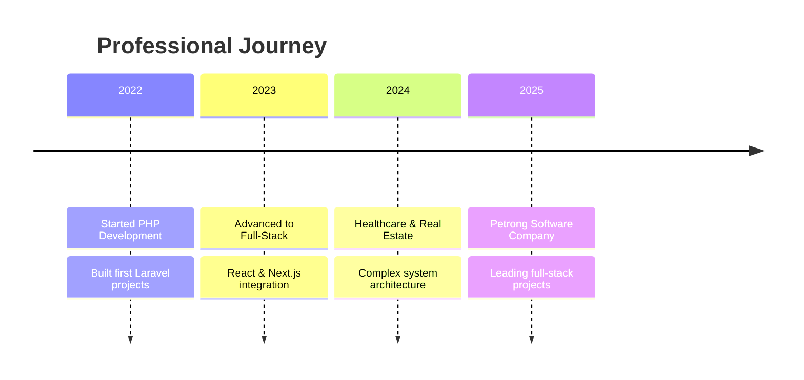

# 🚀 Adeyemi Abiodun | Full-Stack Developer

<div align="center">
  
  
  
  
  
  <br><br>
  
  [](mailto:abiodunemma769@gmail.com)
  [](https://github.com/abiodunemma)
  [](https://www.linkedin.com/in/abiodunemma)
  [](https://maps.google.com/?q=Lagos,Nigeria)

</div>

---

## 🎭 About Me


```javascript
const abiodunemma = {
    title: "Full-Stack Developer",
    experience: "3+ Years",
    specialization: "PHP Laravel Ecosystem",
    currentFocus: "Scalable Web Applications",
    passion: "Clean Code & User Experience",
    availability: "Open for Opportunities",
    
    motto: "Building the future, one line of code at a time 🚀"
};
```

🔥 **What drives me:**
- 💡 Transforming complex business ideas into elegant digital solutions
- 🎯 Crafting APIs that developers love to work with
- 🌟 Building user experiences that make people's lives easier
- 📈 Continuous learning and staying ahead of tech trends
- 🤝 Collaborating with amazing teams to create something extraordinary

<br clear="right"/>

---

## 🛠️ Tech Arsenal

<div align="center">

### 🎨 Frontend Technologies


### ⚡ Backend & Frameworks


### 🔧 Tools & Platforms


### 💳 Payment Integration


</div>

---

## 🎯 Featured Projects

<table>
<tr>
<td width="50%">

### 🍲 [Brinifood - Food Ordering Platform](https://github.com/abiodunemma)
**Multi-role food ordering system**
- 🌍 **International payments** (USD/NGN)
- 👥 **3-tier system**: Customer, Vendor, Admin
- ⚡ **Next.js + TypeScript** frontend
- 💳 **Paystack & Stripe** integration

`Next.js` `TypeScript` `REST API` `Paystack` `Stripe`

</td>
<td width="50%">

### 🏠 [Estate Agent Lagos](https://github.com/abiodunemma)
**Real Estate Management System**
- 🏡 **Property listings** & transactions
- 🔍 **Advanced search** & filtering
- 🏗️ **Repository pattern** implementation
- 📊 **Optimized queries** with eager loading

`Laravel` `PHP` `MySQL` `Blade` `Figma`

</td>
</tr>
<tr>
<td width="50%">

### 🧬 [MyQura Healthcare Platform](https://github.com/abiodunemma)
**Complete Healthcare Ecosystem**
- 👨‍⚕️ **Doctor-Patient** appointments
- 💊 **Prescription** management
- 🧪 **Lab tests** & results
- 💬 **Real-time chat** functionality

`Laravel` `Next.js` `MySQL` `Paystack` `REST API`

</td>
<td width="50%">

### 🎬 [Movie Rating API](https://github.com/abiodunemma/movie)
**Laravel Passport Authentication**
- 🔐 **Secure authentication** system
- ⭐ **Rating & review** system
- 👑 **Admin approval** workflow
- 📧 **Email notifications** with Mailtrap

`Laravel` `Passport` `MySQL` `Mailtrap`

</td>
</tr>
</table>

<details>
<summary>🚀 <strong>View More Projects</strong></summary>

### 💰 [Fintrans - Financial Platform](https://github.com/abiodunemma/finstrans)
E-commerce marketplace with Paystack integration
`Laravel` `PHP` `Paystack`

### 🚌 [Bus Terminal Booking](https://github.com/abiodunemma/busterminal) 
Slot-based transportation booking system
`Laravel` `MySQL`

### 🏷️ [Hashtag Platform](https://github.com/abiodunemma/hashtag)
Tag-based content management system
`Laravel` `REST API`

### 🎙️ [Podcast Application](https://github.com/abiodunemma/PODCAST)
Audio content platform with full-stack implementation
`PHP` `JavaScript` `CSS`

### 🔐 [LogReg Authentication](https://github.com/abiodunemma/Logreg)
User authentication with PayPal payment integration
`Laravel` `PayPal` `Postman`

</details>


## 🏆 Professional Experience

<div align="center">

### 💼 Full Stack Developer @ Petrong Software Company
**January 2025 - Present**

</div>



**Key Achievements:**
- 🚀 Led development of 3 major projects simultaneously
- 💡 Implemented clean architecture patterns across all projects
- 🔥 Integrated multiple payment gateways (Paystack, Stripe, PayPal)
- 📈 Optimized database queries improving performance by 40%
- 👥 Collaborated with cross-functional teams of 5+ developers

---

## 🎯 What I Bring to Your Team

<div align="center">

| 💻 **Technical Excellence** | 🚀 **Innovation** | 🤝 **Collaboration** |
|:---:|:---:|:---:|
| Clean, maintainable code | Always learning new tech | Strong team player |
| Performance optimization | Creative problem solving | Clear communication |
| Best practices adherent | Future-thinking solutions | Mentorship mindset |

</div>

---

## 📈 Current Focus

```yaml🎯 Learning Goals 2025:
  - Advanced Laravel Performance Optimization
  - Microservices Architecture
  - Docker & Kubernetes
  - Advanced React Patterns
  - GraphQL Implementation

🚀 Open for:
  - Full-time Remote Positions
  - Freelance Projects
  - Technical Consulting
  - Code Reviews & Mentoring
```

---

## 🌟 Fun Facts About Me

- 🎓 **Background**: B.Sc. Anatomy → Self-taught Developer
- 🌍 **Location**: Lagos, Nigeria (Open to remote work worldwide)
- ⚡ **Superpower**: Turning complex requirements into simple, elegant solutions
- 🎯 **Mission**: Building applications that make a real difference
- 🔥 **Motto**: "Code with passion, deploy with confidence!"

---

<div align="center">

## 🤝 Let's Build Something Amazing Together!

**I'm always excited to work on innovative projects and collaborate with passionate developers.**

[](mailto:abiodunemma769@gmail.com)
[](mailto:abiodunemma769@gmail.com)
[](https://github.com/abiodunemma?tab=repositories)

<br>

**⭐ If you like my work, please consider giving my repositories a star!**


</div>
